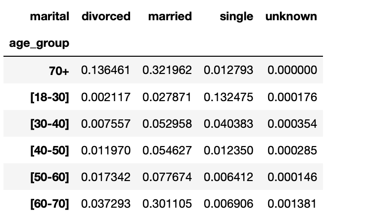

# Customer_Conversion
## Project Overview:
This project involves using python to compute and visualize KPIs for a bank. With focus attention on analyzing conversion rates using bank marketing data.
## Tools and libraries
Python, Matplotlib
## Analysis
### Aggregate Conversion rate.
This is done by dividing the total number of clients subscribed to a term deposit by the total number of clients 
- the conversition rate is 11.27%
### Conversion Rates by Age
This is done by grouping the clients by age and sum over the conversion column to get the total number of conversions by each age.
Then the group by age is then divided by total number of clients in each age group.
To avoid unwanted noise in the old age group, multiple ages are grouped into six groups, based on their age:  between 18 and  30, between 30 and 40, between 40 and 50, between 50 and 60, between 60 and 70, and 70 older. The resulting data are below.

This is visualize using bar plot as shown below

### Conversions vs Non-conversions
Next, demographic differences between converted and clients and non-converted clients are identified.
This is done by counting the number of conversions and non-conversions for each marital status using pandas pivot_table function.
 

It is also represented using pie charts as follows:
 
 
 
### Conversion by Age and Marital Status
This is done by grouping into two columns age_group and marital. Summed the number of conversions in each group and then divide by the total number of clients in each group. Yielded the below results:

This can be visualized using clustered bar charts as this:

